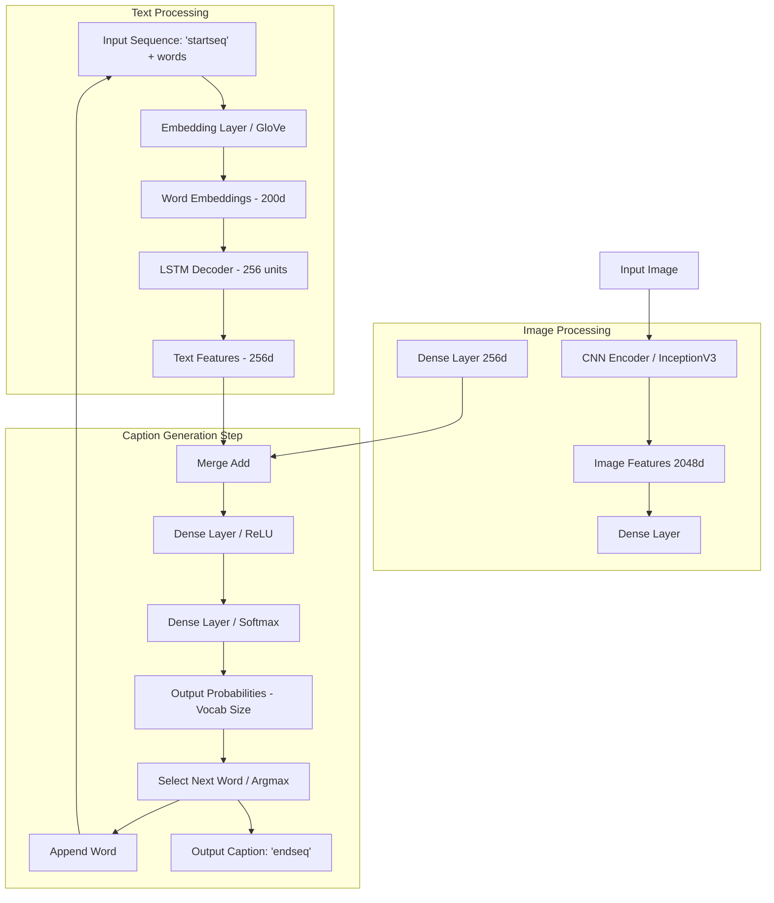

# PixelScribe: Image Caption Generator

A deep learning project implementing a CNN-LSTM model to automatically generate descriptive captions for images, built with Python and TensorFlow/Keras. This project demonstrates an end-to-end machine learning pipeline, including data preprocessing, feature extraction via transfer learning, sequence modeling, training with validation, and qualitative evaluation. Developed as a portfolio project to showcase skills in Deep Learning, NLP, and Computer Vision.

## Features

* Generates natural language captions for input images.
* Uses a CNN (InceptionV3 via Transfer Learning) for image feature extraction.
* Employs an LSTM (RNN) decoder for sequence generation.
* Leverages pre-trained GloVe word embeddings for semantic text representation.
* Trained and evaluated on the Flickr8k dataset.
* Includes scripts for data preprocessing (`src/data_preprocessing.py`), training (`src/train.py`), single image prediction (`src/predict.py`), and example evaluation (`src/evaluate.py`).
* Implements validation checks, early stopping, and model checkpointing during training for optimal convergence.

## Technologies Used

* Python 3.x
* TensorFlow / Keras: Model definition, training, prediction.
* NumPy: Numerical operations.
* NLTK: BLEU score calculation for evaluation examples.
* Pillow / Matplotlib: Image loading and display.
* GloVe: Pre-trained word embeddings.
* InceptionV3: Pre-trained CNN for feature extraction.
* LSTMs: Recurrent Neural Network layer for sequence decoding.
* Pickle: Saving/loading features and vocabulary.
* Argparse: Command-line interface for scripts.
* Git / GitHub: Version control and hosting.

## Architecture Overview

This project uses an Encoder-Decoder architecture:

1.  Encoder (CNN): A pre-trained InceptionV3 model (with its final classification layer removed) processes the input image and extracts a 2048-dimension feature vector representing the image content. Weights are frozen (transfer learning).
2.  Decoder (LSTM): An LSTM network takes the image feature vector (processed through a Dense layer) and the previously generated words (represented by 200d GloVe embeddings) as input at each time step to predict the next word in the caption sequence. `mask_zero=True` is used in the Embedding layer to handle variable sequence lengths.
3.  Merging: The image features and text features are merged using element-wise addition before being passed through further Dense layers.
4.  Output: A final Dense layer with a Softmax activation function outputs a probability distribution over the vocabulary for the next word.




## Setup and Installation

1. Prerequisites:
* Python (3.8+ recommended)
* pip
* Git
 *(Optional: A virtual environment (`venv` or `conda`) is recommended)

2. Clone Repository:
```bash
git clone [https://github.com/](https://github.com/)[Your_GitHub_Username]/PixelScribe.git
cd PixelScribe
```
3. Install Dependencies:
```bash
pip install -r requirements.txt
```
4. Download necessary NLTK data for evaluation script
```bash
python -m nltk.downloader punkt
```

5. Download Data & Embeddings:
Flickr8k Dataset: Download the dataset images and required annotation files. You can often find this dataset via Kaggle or academic sources.
Create a data/ directory in the project root.
Place the images inside data/Flicker8k_Dataset/.
Place annotation files (Flickr8k.token.txt, descriptions.txt, Flickr_8k.trainImages.txt, Flickr_8k.testImages.txt, Flickr_8k.devImages.txt) inside the data/ directory. (Link: https://github.com/jbrownlee/Datasets/releases/download/Flickr8k)
GloVe Embeddings: Download the glove.6B.200d.txt file.
Create a glove/ directory in the project root.
Place the .txt file inside glove/. (Link: https://nlp.stanford.edu/projects/glove/)
6. Generate Image Features OR Download Pre-computed:
Image features must be extracted using InceptionV3. This is time-consuming.
Option A (Generate): (You might want to create a simple src/run_feature_extraction.py script for this)
Run the feature extraction process for train and test image sets defined in the data/ text files. This will create .pkl files.
Place the generated encoded_train_images.pkl and encoded_test_images.pkl into a directory (e.g., saved_features/). Update paths in scripts if needed.
Option B (Download - Recommended for Ease of Use):
Download the pre-computed feature files:
encoded_train_images.pkl: [https://drive.google.com/file/d/1w0Wwlv1_Ovy5z-MDVTBo9bj_yNjR4Gah/view?usp=drive_link]
encoded_test_images.pkl: [https://drive.google.com/file/d/1d8o_G9kflq1lr40-t71ZDqHZSg7tpJ9u/view?usp=drive_link]
Create a saved_features/ directory in the project root.
Place the downloaded .pkl files inside saved_features/.
## Usage
(Examples assume data is in ./data/, features in ./saved_features/, GloVe in ./glove/, and outputs go to ./training_output/. Adjust paths in commands as needed.)
1. Training:
Train a new model or fine-tune. The script saves the best weights based on validation loss, vocabulary mappings, and max length to the output directory.
```bash
python src/train.py \
    --token_path ./data/Flickr8k.token.txt \
    --train_ids_path ./data/Flickr_8k.trainImages.txt \
    --dev_ids_path ./data/Flickr_8k.devImages.txt \
    --train_features_path ./saved_features/encoded_train_images.pkl \
    --test_features_path ./saved_features/encoded_test_images.pkl \
    --glove_path ./glove/glove.6B.200d.txt \
    --output_dir ./training_output \
    --epochs 50 \
    --batch_size 3 \
    --patience 5
```    
2. Prediction (Single Image):
Generate a caption for a specific image using the trained weights and saved vocabulary.
```bash
python src/predict.py \
    --image_path /path/to/your/image.jpg \
    --weights_path ./training_output/best_model.weights.h5 \
    --vocab_path ./training_output/vocab_mappings.pkl \
    --max_length_path ./training_output/max_length.pkl
```
3. Evaluation (Examples):
Generate captions and calculate sentence-BLEU scores for a few random test examples. Requires original image directory for display.
```bash
python src/evaluate.py \
    --weights_path ./training_output/best_model.weights.h5 \
    --features_path ./saved_features/encoded_test_images.pkl \
    --token_path ./data/Flickr8k.token.txt \
    --test_ids_path ./data/Flickr_8k.testImages.txt \
    --train_ids_path ./data/Flickr_8k.trainImages.txt \
    --vocab_path ./training_output/vocab_mappings.pkl \
    --max_length_path ./training_output/max_length.pkl \
    --image_dir ./data/Flicker8k_Dataset/ \
    --num_examples 5 \
    --output_file ./evaluation_examples.txt
```
## Results & Evaluation
The model was trained for up to 50 epochs with early stopping monitoring validation loss (best val_loss achieved: ~2.37). Qualitative evaluation and example-based sentence-BLEU scores were used to assess performance.


Example 1: Success Case
Image: `317488612_70ac35493b.jpg`
  


Generated: dog is running through the snow
Reference: dog is playing in the deep snow
Scores: BLEU-1=1.000, BLEU-2=1.000, BLEU-3=1.000, BLEU-4=1.000
Analysis: The model accurately captures the main subject and setting, producing a caption nearly identical to a human reference, demonstrating strong performance on familiar scene types likely well-represented in Flickr8k.


Example 2: Partial Success / Detail Error
Image: `260828892_7925d27865.jpg`
    

Generated: the three girls are enjoying the ocean at the beach
Reference: lone person walking in the distance on long beach
Scores: BLEU-1=0.400, BLEU-2=0.298, BLEU-3=0.106, BLEU-4=0.063
Analysis: While correctly identifying the beach setting (high BLEU-1), the model fails on subject count ('three girls' vs 'lone person') and the specific action. The low BLEU-4 reflects poor phrase matching. This highlights limitations in counting and detailed activity recognition.


Example 3: Generalization Failure
Image: `370713359_7560808550.jpg`
    

Generated: woman in black shirt is standing outside of shop

Reference: an empty seat at mexican themed restaurant

Scores: BLEU-1=0.111, BLEU-2=0.037, BLEU-3=0.028, BLEU-4=0.024

Analysis: The model completely misinterprets the scene, hallucinating unrelated subjects and objects. The extremely low BLEU scores confirm the lack of relevance. This likely stems from the image content differing significantly from typical Flickr8k scenes or limitations in the baseline model's feature interpretation.
Overall: The implemented baseline model demonstrates the feasibility of the CNN-LSTM approach for image captioning. It successfully generates grammatically plausible captions and performs well on common scenes found in the training data (e.g., dogs in snow). However, qualitative analysis and BLEU scores on specific examples reveal limitations in handling fine-grained details, accurate object counting, and generalization to less common or complex scenes. The Greedy Search decoding contributes to these limitations.

## Limitations & Future Work
Dataset: Flickr8k's limited size and scope restrict the model's ability to generalize. Training on larger datasets (MS COCO, Conceptual Captions) would be beneficial.

Baseline Model: This CNN+LSTM architecture is standard but basic. Implementing Attention mechanisms would allow the decoder to focus on relevant image regions, likely improving accuracy and relevance significantly.

Decoding Strategy: Greedy Search was used for evaluation. Implementing and comparing with Beam Search could produce more fluent and globally optimal captions.

Evaluation Metrics: The evaluation relied on qualitative analysis and example sentence_bleu. Implementing the full COCO evaluation suite (CIDEr, SPICE, METEOR, ROUGE) would allow for standardized benchmarking.

Fine-Tuning: Exploring fine-tuning of GloVe embeddings or upper layers of the InceptionV3 encoder could potentially yield performance gains.

## Contact
Naman Nandana

Email: nnandan2@asu.edu

LinkedIn: https://www.linkedin.com/feed/

GitHub: https://github.com/naman617


